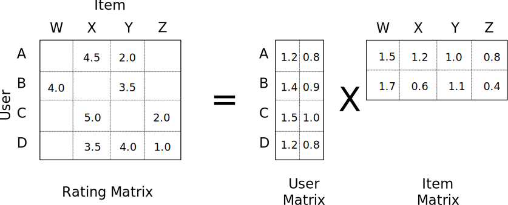
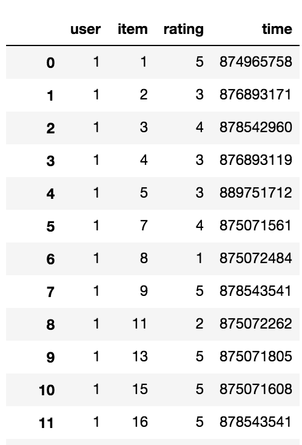
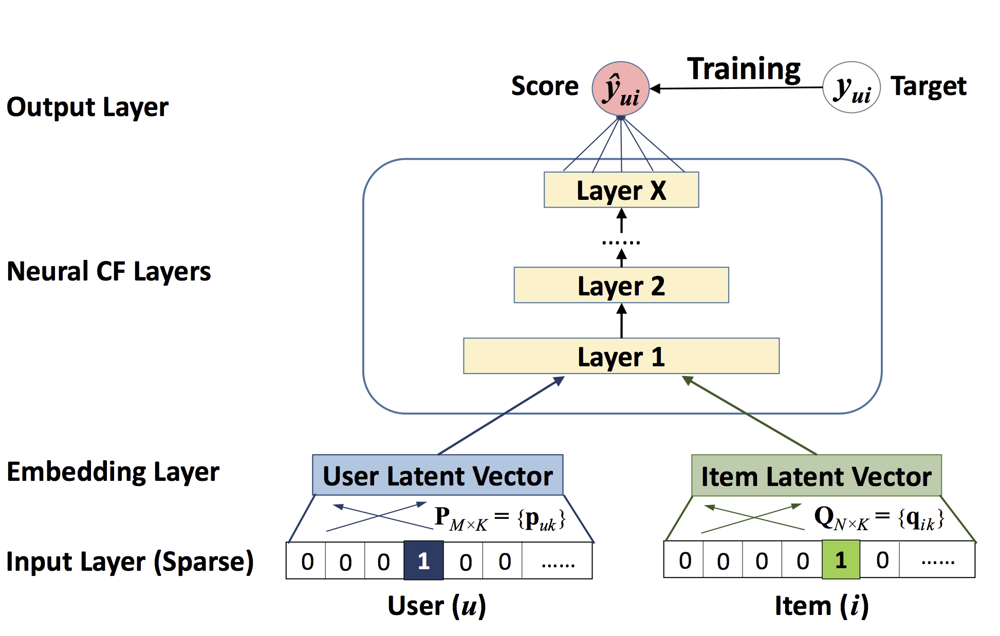

# What are recommender systems?

A recommender system is a machine learning model, which predicts the preference a user would assign to an item.  These systems are used to understand what facebook articles you'd like to read, which youtube videos you will watch, what amazon items you'll most likely buy and so on.

I did not used to think recommender systems were particularly interesting.  I remember briefly covering matrix factorization and collaborative filtering (two established recommender techniques) during the Master of Data Science program at the University of British Columbia.  My initial impression was that there must be far more interesting problems to solve that selling an extra item to a user on amazon.com or predicting what videos to show users  on youtube.com.  It all seemed depressing and vacuous when compared to ML applications in self driving cars, medical image processing and natural language understanding.

However, being fascinated by all applications of deep learning, I've recently been thinking "I wonder if deep learning is used in state of the art recommenders?".  Turns out, yes, everywhere.... The results have been quite astonishing, both in improved system performance and cash money for the companies leveraging it.

# What is the current state of art?

If you want to read up on the current state of the art the following paper provides a great review:
 
- [Deep Learning based Recommender System: A Survey and New Perspectives](https://arxiv.org/pdf/1707.07435.pdf)
 
And a few must reads:

- [neural collaborative filtering](https://www.comp.nus.edu.sg/~xiangnan/papers/ncf.pdf)
- [Visual Bayesian Personalized Ranking from Implicit Feedback](https://arxiv.org/pdf/1510.01784.pdf)
- [wide and deep learning for recommender systems](https://arxiv.org/pdf/1606.07792.pdf)
- [A Neural Autoregressive Approach to Collaborative Filtering](https://arxiv.org/pdf/1605.09477.pdf)
- [A fast learning algorithm for deep belief nets](https://www.cs.toronto.edu/~hinton/absps/fastnc.pdf)
- [Restricted Boltzmann Machines for Collaborative Filtering](https://www.cs.toronto.edu/~rsalakhu/papers/rbmcf.pdf)

And here are a few great videos:

- [Alexandros Karatzoglou: Deep Learning for Recommender Systems](https://www.youtube.com/watch?v=KZ7bcfYGuxw)
- [Deep Learning for Personalized Search and Recommender Systems part 1](https://www.youtube.com/watch?v=0DYQzZp68ok&t=4999s)

# Ok but why are they interesting?

High quality recommenders typically ingest a **massive quantity and diversity of data**.  Since deep learning attempts to learn valid features, the more user and product features we input the better. This includes product images, user search queries, click history, purchase sequences and just about everything you can find on a person from their online footprint. As a result state of the art systems utilize convolutional layers, recurrent layers, embedding of categorical feature and deep/wide model architectures.  

Since recommenders often have a vast quantity of training data, **very large models can be trained**.  Alexandros Karatzoglou, Scientific Director at Telefonica Research, noted in his lecture [Deep Learning for Recommender Systems](https://www.youtube.com/watch?v=KZ7bcfYGuxw) that their research team train models as large as they can fit in the memory of a single gpu. With the recent advances in gpu hardware, this means we are talking a model with so many parameters it is 500Gb. Now we have to distribute the training of models on many gpu's in the cloud, and keep prediction time low enough that we can use the model when a user visits our website.  Sounds interesting right?!

Another reason recommender systems are interesting to me is that many companies make massive online revenue, but are not up to speed on the state of the art.  The potential for a small team of data scientists to massively increase online sales revenue, while pretty souless, is an exciting impact to have. I would expect data scientists specializing in state of the art recommender system implentation to  make some serious salaries.

In this post I will implement [neural collaborative filtering](https://www.comp.nus.edu.sg/~xiangnan/papers/ncf.pdf). This is a very simple model, which provides a great framework to explain our input data, evaluation metrics and some common tricks to deal with scalability problems.

# Neural collaborative filtering

### A note on matrix factorization

Xiangnan He et al. put it best:

> The key to
a personalized recommender system is in modelling users’
preference on items based on their past interactions (e.g.,
ratings and clicks), known as collaborative filtering [31, 46].
Among the various collaborative filtering techniques, matrix
factorization (MF) [14, 21] is the most popular one, which
projects users and items into a shared latent space, using
a vector of latent features to represent a user or an item.
Thereafter a user’s interaction on an item is modelled as the
inner product of their latent vectors.


> Images from [Factorization Machines A Theoretical Introduction](http://jxieeducation.com/2016-06-26/Factorization-Machines-A-Theoretical-Introduction/)

The figure above shows a matrix factorization where each user (A, B, C, D) is assigned a latent feature vector of size 2. Each item (W, X, Y, Z) is also assigned a latent feature vector of size 2. These vectors are learned, such that their inner product produces the rating matrix.

Neural collaborative filtering is a flexible neural network architecture, which can be used to learn more complex (non linear) interactions between user and item latent feature vectors. It can also be generalized to represent the traditional matrix factorization method.

Before I explain the architecture, lets talk more about our input data and iterators which will feed our neural network.

### Input Data

The raw training data for this model consists of 100,000 movie reviews (1-5). Each record describes the rating a user assigned to an item. There are 943 users and 1682  users in this dataset.

Notice that the raw data is in the form of implicit feedback (reviews from 1-5). This  means a user has actually inferred their preference on an item. In real world scenarios, it is far easier to collect vast quantities of implicit feedback. Clicking on products, buying items, watching movies you get the idea. 

For this reason we will convert the movie reviews into implicit form. We want to build a model that is useful with implicit data. Any movie that has been reviewed gets a 1, any movie that wasn't reviewed gets a 0. 



We have 943 users and 1682 movies. This is a total of 1,586,126 possible interactions.100,000 of these combinations will be 1, where the movie was reviewed. The remaining 1,486,126 will be 0, where the users did not review the movies. This is where scalability becomes a problem, since the number of training examples explodes with more users or items.

To deal with this problem, negative sampling is used. This approach simply selects *n* random non-interactions (0's) for every interaction in our data. In this post we will sample 4 negatives per interation in the training set. The test set will be sampled slightly differently, due  to the metrics we will use (more later).

The code below defines a custom MXNet iterator class, which stores the data in the scipy sparse matrix, producing arrays of training data when the batch is required.

```python
Class SparseNegSampleIter()
```

### Iterators , Negative Sampling & Intuition

### Model Architecture


> Image from [neural collaborative filtering](https://www.comp.nus.edu.sg/~xiangnan/papers/ncf.pdf) figure 2


## Understanding the input data

- Implicit feedback denotes whether a user interacted with an item or not (0 or 1) as opposed to explicit feedback such as a movie review (6/10).
- We don't want a model to predict what a user would rate a movie.  We want a model to predict if a user will watch a movie!  Because the later makes money.
- Therefore, we treat input data as implicit feedback, regardless of its form.
- Recommender input data is incredibly sparse.  In the case of the MovieLens 1M Dataset, we  have 1,000,000 interactions (1's) in over 22 million records! (0's & 1's)
- Dataset only contains 1's.  One approach is to generate all negative data. Another is to randomly generate less of it.
- The test set is the last interaction (in time) of every user.

## Understanding the architecture

##### MLP architecture

- For each training record X is a single user to single item combination. Y is the implicit feedback (0 or 1).
- The input user_id and item_id are both embedded to a some length (latent features).
- Embeddings are concatenated and passed through hidden layers.
- Finally the layer size is reduced to 1 unit, with sigmoid activation (can only be between 0 & 1).
- The binary cross entropy loss is applied & weights updated with some optimizer.  In real systems the pairwise loss could be a superior extension (interaction data more important than non interaction data).

##### GMF architecture

- For each training record X is a single user to single item combination. Y is the implicit feedback (0 or 1).
- The input user_id and item_id are both embedded to a some length (latent features).
- Embeddings are concatenated and passed through hidden layers.
- Finally the layer size is reduced to 1 unit, with sigmoid activation (can only be between 0 & 1).
- The logistic loss is applied & weights updated with some optimizer.

##### Hybrid architecture

## Understanding important recommender test metrics

- HR@10, NCDG@10 used
- For evaluation, randomly sample  100 non-interacted items for each user and rank the test item amoung them.
- Compute HR (hit ratio) and NDCK (Normalized Discounted Cumulative Gain) on this example.
- Only take 10 rankings.
- Otherwise when you compute test error, you would need to compute the probability of interaction of all user and item combinations.
- process is for each user to randomly select 100 random samples not interacted with.

## Understanding Tricks

- You can do product to vec.  Products with similar vectors appear around the same other kind of products.  Context represents the other purchases of the user. A sentence is the product history.

- store user and item features in a distributed key value store, so you can look them up for each user at scale

- wide and deep models appear to be the state of the art

- item utility is defined by business decisions (revenue, diversity, CTR) and optimized using lagrange methods


